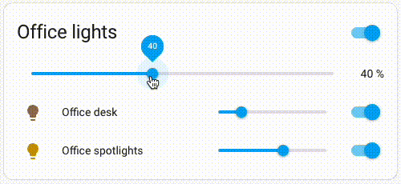

# Relative brightness light group
Light group for Home Assistant that maintains relative brightness between lights as group brightness is changed.



> Note: Since this light group is built on top of the core light group, it also has that "bouncy" brightness slider [behavior](https://community.home-assistant.io/t/light-groups-bouncy-brightness-slider-behaviour/501539) depending on your setup. 

## Installation 
[
    ](https://my.home-assistant.io/redirect/hacs_repository/?owner=oscarb&repository=https%3A%2F%2Fgithub.com%2Foscarb%2Frelative-brightness-light-group)

### HACS

Because this custom integration is overriding a core integration, it needs to be added as a [custom repository](https://hacs.xyz/docs/faq/custom_repositories).

**Repository:**  `https://github.com/oscarb/relative-brightness-light-group`

**Category:**  Integration

### Manual

1. Download this repository
2. opy over the `custom_components` folder into your Home Assistant `conifg` folder
3. Restart Home Assistant


## Usage

Using this is as easy as using a normal [light group](https://www.home-assistant.io/integrations/group/). 

In your `configuration.yaml`, simply add: 

```yaml
light:
  - platform: relative_brightness_light_group
    name: The Office
    entities:
      - light.office_desk
      - light.office_spotlights
```


